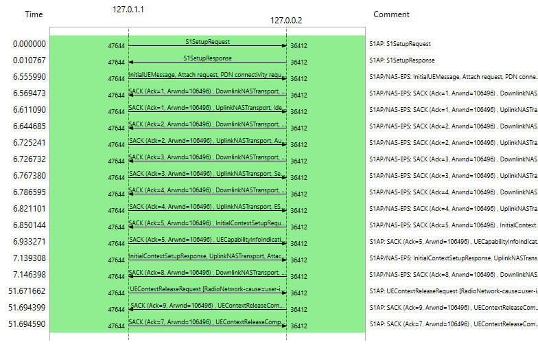
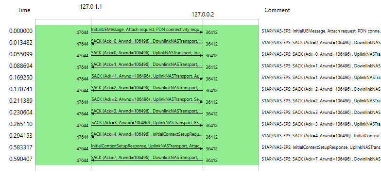
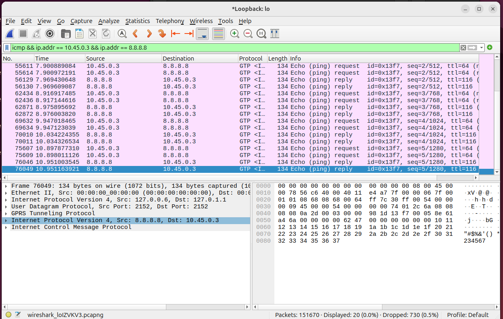
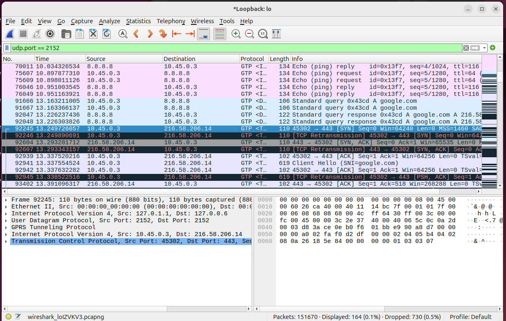

# Packet Captures — LTE Attach, End to End

Two Wireshark **Statistics → Flow Graph** captures, taken on the `lo` interface (S1 side, between `srsenb` at `127.0.1.1` and Open5GS's MME at `127.0.0.2`), showing the complete EMM/ESM attach procedure — not just the summary, the full authentication and security exchange that earlier capture attempts had missed.

## Full core-side signaling (`s1ap || nas-eps`)



## NAS-only view (`nas-eps`)



## The full message sequence

| Time (s) | Direction | Message |
|---:|:---:|---|
| 0.000000 | eNB → MME | S1AP: S1 Setup Request |
| 0.010767 | MME → eNB | S1AP: S1 Setup Response |
| 6.555990 | UE → MME | InitialUEMessage: **Attach Request**, PDN Connectivity Request |
| 6.569473 | MME → UE | DownlinkNASTransport: Identity Request |
| 6.611090 | UE → MME | UplinkNASTransport: Identity Response |
| 6.644685 | MME → UE | DownlinkNASTransport: **Authentication Request** |
| 6.725241 | UE → MME | UplinkNASTransport: **Authentication Response** |
| 6.726732 | MME → UE | DownlinkNASTransport: **Security Mode Command** |
| 6.767380 | UE → MME | UplinkNASTransport: **Security Mode Complete** |
| 6.786595 | MME → UE | DownlinkNASTransport: ESM Information Request |
| 6.821101 | UE → MME | UplinkNASTransport: ESM Information Response |
| 6.850144 | MME → eNB | InitialContextSetupRequest + **Attach Accept** + Activate Default EPS Bearer Context Request |
| 6.933271 | eNB → MME | UECapabilityInfoIndication |
| 7.139308 | eNB → MME | InitialContextSetupResponse + UplinkNASTransport: **Attach Complete** + Activate Default EPS Bearer Context Accept |
| 7.146398 | MME → UE | DownlinkNASTransport: EMM Information |
| 51.671662 | eNB → MME | UEContextReleaseRequest [RadioNetwork-cause = user-inactivity] |
| 51.694399 / 51.694590 | MME ↔ eNB | UEContextReleaseComplete |

**Total attach time (Attach Request → Attach Complete): ~0.59 seconds.**
**Time to idle (RRC/S1 context release due to inactivity): ~51 seconds after Attach Complete** — the eNB's inactivity timer releasing the UE back to `RRC_IDLE`, exactly as described in the [README](./README.md)'s note on RRC behavior.

## Why this capture matters

An earlier capture attempt (filtered too narrowly) only showed Attach Request → ESM Information → Attach Accept/Complete, with the Authentication and Security Mode exchange missing from view — raising the question of whether authentication had happened at all. It had; it just wasn't captured. This unfiltered `s1ap || nas-eps` capture resolves that: the full Identity → Authentication → Security Mode → ESM Information sequence is all present, in the correct 3GPP order, before the bearer is ever set up.

## Full internet reachability, confirmed at the packet level

After resolving a chain of host-level routing issues (see [`TROUBLESHOOTING.md`](./TROUBLESHOOTING.md) — missing NAT rule, empty FORWARD chain after a restart, and namespace-local DNS pointing at a stub resolver with nothing listening), the UE gets genuine end-to-end internet connectivity through the tunnel:

**ICMP echo, request and reply, both directions, through the GTP tunnel:**



**A full DNS resolution + TCP handshake + TLS ClientHello to a real site, entirely through the UE's LTE data path:**



This is the strongest single piece of evidence in the whole lab: it's not just "the LTE stack completed an attach" — it's a UE on this software network doing a real DNS lookup, a real TCP three-way handshake, and starting a real TLS session with `google.com`, indistinguishable at the packet level from a phone on a real carrier network.

## How to reproduce this capture

```bash
sudo tcpdump -i lo -w s1_full_attach.pcapng
```
Start the eNB, then the UE, let the attach complete, then in Wireshark:

1. Open the capture.
2. Apply display filter: `s1ap || nas-eps`
3. **Statistics → Flow Graph**
4. Flow type: **Network Source/Destination Address**, check **Limit to display filter**

For the NAS-only view, change the display filter to `nas-eps` before opening Flow Graph.
